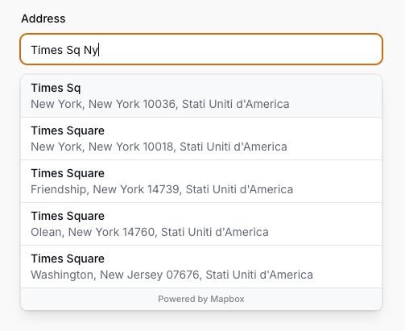

# Filament Mapbox

This package provides a set of tools for integrating [Mapbox](https://www.mapbox.com/) within
the [Filament](https://filamentphp.com/) ecosystem.


## Getting started

### Prerequisites

This package has been built for **Filament 3** and has been tested only with **PHP 8.4** and **Laravel 12**.

### Installation

The package can be installed using [Composer](https://getcomposer.org/) with the following command:

```bash
composer require speniti/filament-mapbox
```

## Usage

### Geocoder Form Component

A geocoder component using the [Mapbox Geocoding API](https://docs.mapbox.com/api/search/#geocoding).
It Can be used in a form to search for an addresses.



#### Basic Usage

To search for an address, you can use it without any option:

```php
public function form(Form $form): Form
{
    return $form->schema([
        Geocoder::make('address'),
    ]);
}
```

#### Options

The component can be customized with the following options:

```php
Geocoder::make('address')
    // If true, the geocoder control will clear its contents and blur when the user presses the escape key (default true).
    ->clearAndBlurOnEsc(bool|Closure $clearAndBlurOnEsc = true) 
    // Limit the result to the specified countries.
    ->countries(string|array|Closure $countries) 
    // Like the one before but only one country.
    ->country(string|Closure $country)
    // Specify whether the Geocoding API should attempt approximate, as well as exact, matching when performing searches (default true).
    ->fuzzyMatch(bool|Closure $fuzzyMatch = true)
    // Limit the maximum number of results to show (default 5).
    ->limit(int|Closure $limit)
    // Set the minimum number of characters to enter before results are shown (default 2).
    ->minLength(int|Closure $minLength)
    // Set a list of types that filter results to match those specified.
    ->types(FeatureType|array|Closure $types)
```

See [FeatureType.php](src/Geocoder/FeatureType.php) for available types.

Aside from the custom options, the component supports placeholder, affixes and suffixes and can be disabled.  
The only validation rule supported is `required`.

#### Localization

The component supports localization. The applied language will depend on the browser's language settings.

#### Output formats

Depending on how you typehint the form property associated with the component,
you can get the output in different formats.

For instance if you typehint `string` you will get the address as a string:

```php
public string $address = '';

public function form(Form $form): Form
{
    return $form->schema([
        Geocoder::make('address'),
    ]);
}

public function save(): void
{
    $data = $this->form->getState();
    
    // $address is a string containing the full address.
    // $data['address'] is also a string containing the full address.
    // e.g. "Times Square, New York, New York 10018, Stati Uniti d'America"
}
```

In a similar way, if you typehint `array` you will get an associative array with the address parts:

```php
 /** @var array<mixed> */
public array $address = [];

public function form(Form $form): Form
{
    return $form->schema([
        Geocoder::make('address'),
    ]);
}

public function save(): void
{
    $data = $this->form->getState();
    
    // $address is an associative array containing the address parts.
    // $data['address'] is also an associative array containing the address parts.
    // e.g. [
    //  address" => "Times Square"
    //    "street" => "Times Square"
    //    "postcode" => "10018"
    //    "place" => "New York"
    //    "region" => "New York"
    //    "country" => "Stati Uniti d'America"
    //    "placeName" => "Times Square, New York, New York 10018, Stati Uniti d'America"
    //    "coords" => array:2 [
    //      0 => -73.98769
    //      1 => 40.75534
    //    ]
    //]
}
```

Lastly, if you prefer a DTO-like approach,
you can typehint `AddressInfo` and you will get an instance of the [AddressInfo](src/Geocoder/AddressInfo.php) class:

```php
public AddressInfo $address;

public function mount(): void
{
    $this->address = new AddressInfo();
}

public function form(Form $form): Form
{
    return $form->schema([
        Geocoder::make('address'),
    ]);
}

public function save(): void
{
    $data = $this->form->getState();
    
    // $address is an instance of AddressInfo containing the address parts.
    // $data['address'] is also an instance of AddressInfo containing the address parts.
    // e.g. Peniti\FilamentMapbox\Geocoder\AddressInfo {
    //    placeName: "Times Square, New York, New York 10018, Stati Uniti d'America"
    //    address: "Times Square"
    //    houseNumber: null
    //    street: "Times Square"
    //    postcode: "10018"
    //    place: "New York"
    //    region: "New York"
    //    country: "Stati Uniti d'America"
    //    coords: array:2 [
    //      0 => -73.98769
    //      1 => 40.75534
    //    ]
    //  }
}
```

## Contributing

Thank you for considering contributing to Filament Mapbox! You can read the contribution guide [here](CONTRIBUTING.md).

## Code of Conduct

To ensure that the community is welcoming to all, please review and abide by the [Code of Conduct](CODE_OF_CONDUCT.md).

## License

Filament Mapbox is open-sourced software licensed under the [MIT license](LICENSE).
